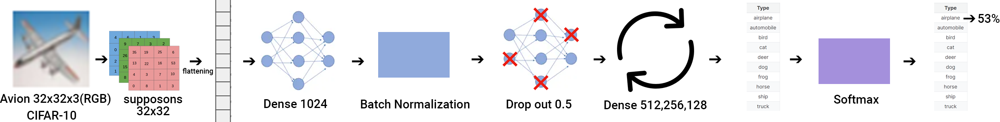
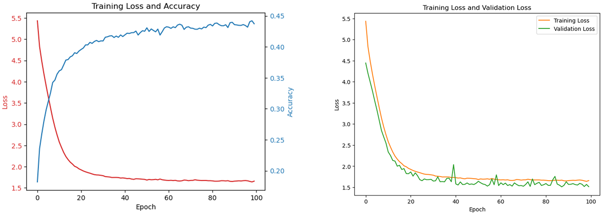
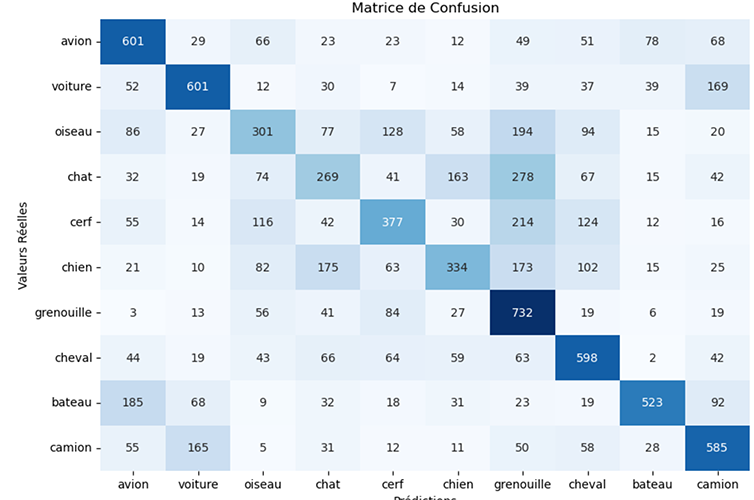
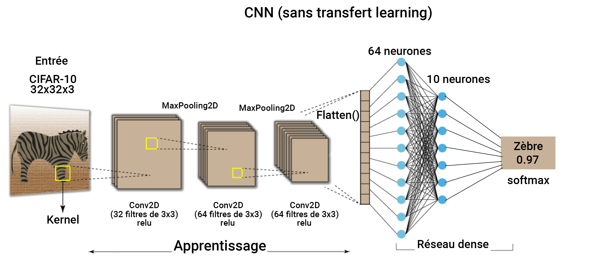
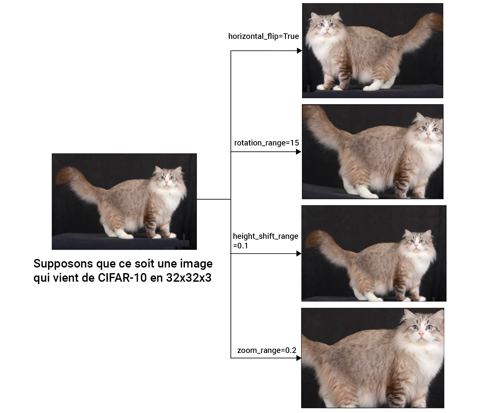
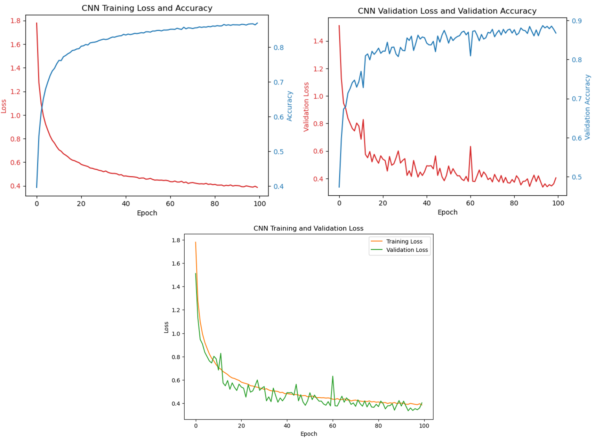
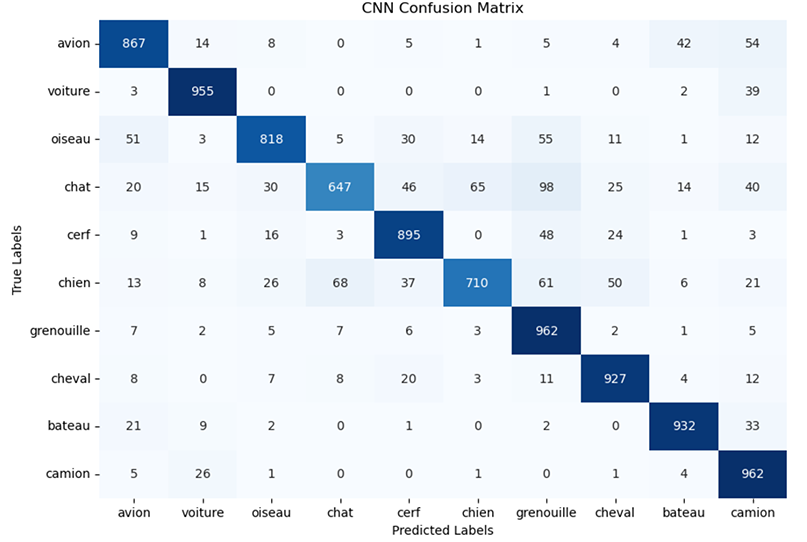
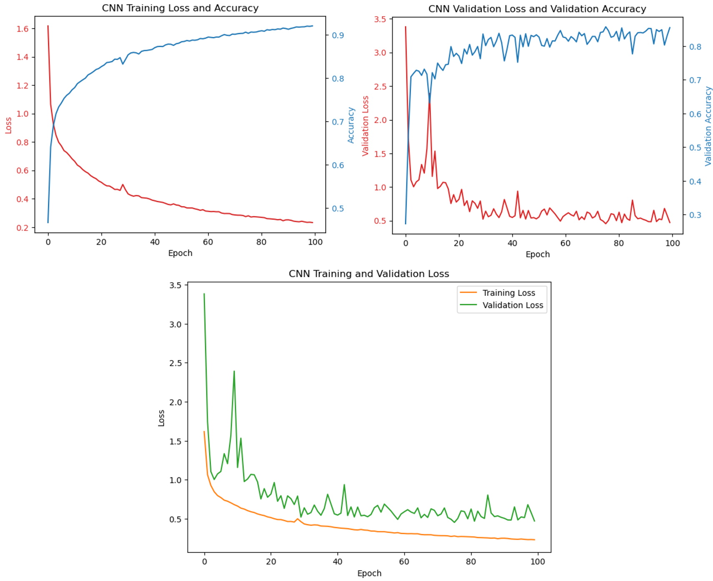
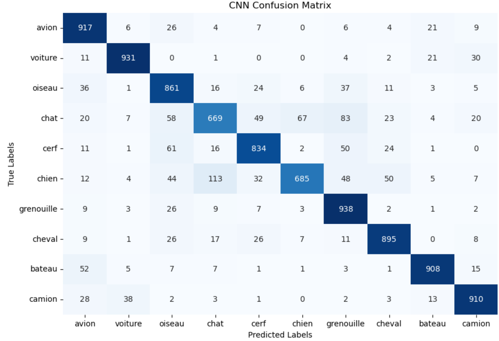

# Développement de Réseaux de Neurones pour la Classification CIFAR-10

## Introduction

La base de données CIFAR-10 est une collection standardisée et largement utilisée dans le domaine de l'apprentissage automatique et de la vision par ordinateur. Elle comprend 60 000 images en couleur, chacune de taille 32x32 pixels et réparties en 3 canaux (Rouge, Vert, Bleu - RGB), ce qui donne à chaque image une forme de 32x32x3. Ces images sont divisées en 10 classes distinctes, avec 6 000 images par classe, couvrant une variété d'objets et d'animaux tels que des voitures, des oiseaux, des chats, etc. L'objectif principal de ce travail pratique est de concevoir et d'implémenter trois architectures de réseaux de neurones distinctes pour classifier ces images de manière précise et efficace. Ces architectures comprennent : 

1. Un **réseau dense (Fully Connected)**, utilisé comme modèle de base pour établir une performance de référence.
2. Un **réseau de neurones convolutifs (CNN) sans transfert d'apprentissage**, pour exploiter la capacité des CNN à capter les caractéristiques spatiales des images.
3. Un **réseau de neurones convolutifs (CNN) avec transfert d'apprentissage**, pour tirer parti des connaissances préalablement acquises par des modèles entraînés sur de vastes ensembles de données.

Chacune de ces architectures sera évaluée et comparée en termes de précision de classification, d'efficacité en matière d'apprentissage et de capacité à généraliser à partir des données de test. Ce projet vise non seulement à démontrer la supériorité des CNN pour les tâches de vision par ordinateur mais aussi à explorer l'impact du transfert d'apprentissage sur l'amélioration des performances de classification.

## Réseau Dense

### Architecture et Implémentation

.

Le réseau dense a été conçu avec plusieurs couches pour traiter les images du dataset CIFAR-10, qui contiennent des objets en couleur de dimensions 32x32x3. L'architecture du réseau est la suivante :

- **Flatten**: Convertit les images 3D en vecteurs 1D.
- **Première couche dense**: 1024 neurones, activation ReLU, régularisation L2.
- **BatchNormalization**: Normalisation des activations.
- **Dropout**: Taux de 0.5 pour réduire le sur-apprentissage.
- **Deuxième couche dense**: 512 neurones, activation ReLU, régularisation L2.
- Répétition de la normalisation par lots et du dropout.
- **Troisième couche dense**: 256 neurones, suivi de BatchNormalization et Dropout.
- **Quatrième couche dense**: 128 neurones, suivi de BatchNormalization et Dropout.
- **Couche de sortie**: 10 neurones (un pour chaque classe), activation Softmax.

### Résultats de l'Entraînement

L'entraînement du réseau dense sur 100 époques a produit les résultats suivants :

.

- **Début de l'entraînement**: Loss de 5.4343, Accuracy de 18.19%, Validation Loss de 4.4456, Validation Accuracy de 32.16%.
- **Progression rapide** au cours des premières époques, avec une amélioration continue de l'accuracy et une réduction de la loss.
- **Après 100 époques**: Loss de 1.6591, Accuracy de 43.73%, Validation Loss de 1.5146, Validation Accuracy de 49.21%.

Ces résultats montrent une amélioration significative de l'accuracy et de la loss au fil du temps, bien que l'accuracy de validation indique encore un potentiel de sur-apprentissage.

Le choix de 100 époques pour l'entraînement du réseau dense découle de notre objectif de fournir une base solide pour comprendre comment un modèle simple se comporte sur ce dataset. Cette durée permet au réseau dense d'apprendre suffisamment des données sans atteindre nécessairement le point de sur-apprentissage ou de convergence optimale, ce qui est souvent observé avec des architectures plus complexes. Notre objectif n'était pas d'optimiser ce modèle à l'extrême, mais plutôt d'établir une limite inférieure des performances attendues. Cela crée un point de comparaison pour les architectures suivantes, plus sophistiquées, comme les réseaux de neurones convolutifs (CNN).

### Analyse des Performances

L'analyse des performances sur le set de test a révélé les précisions suivantes par classe :

.


- **Avion**: 53% de précision
- **Voiture**: 62% de précision
- **Oiseau**: 39% de précision
- **Chat**: 34% de précision
- **Cerf**: 46% de précision
- **Chien**: 45% de précision
- **Grenouille**: 40% de précision
- **Cheval**: 51% de précision
- **Bateau**: 71% de précision
- **Camion**: 54% de précision

L'accuracy globale a atteint 49.21%, illustrant la capacité du modèle à classifier de manière assez juste les images CIFAR-10, malgré la simplicité relative d'un réseau dense pour ce type de tâche.
Temps d'entraînement total : 851.59 secondes
soit un peu plus de 14 minutes

### Conclusion sur le Réseau Dense

Bien que le réseau dense ait montré une capacité certaine à apprendre à partir des images CIFAR-10, les limitations inhérentes à ce type d'architecture pour le traitement d'images complexes sont apparentes. Cela justifie l'exploration d'architectures convolutives plus avancées, susceptibles de capturer plus efficacement les caractéristiques spatiales des images.

Les réseaux denses ne capturent pas efficacement les caractéristiques spatiales et hiérarchiques présentes dans les images, ce qui est crucial pour des performances élevées dans la classification d'images. En revanche, les CNN sont spécifiquement conçus pour traiter ce type de données. Ils exploitent la structure spatiale des images grâce à l'opération de convolution, permettant de détecter des motifs et caractéristiques à différents niveaux de granularité.

Ainsi, bien que le réseau dense serve d'introduction utile et de baseline pour notre projet, nous avons préféré concentrer nos efforts sur les réseaux convolutifs. Ces derniers sont nettement plus adaptés à notre objectif principal : atteindre une précision maximale dans la classification des images CIFAR-10.


# Rapport sur le Développement d'un Réseau de Neurones Convolutifs sans Transfert d'Apprentissage pour CIFAR-10

## Introduction

Les réseaux de neurones convolutifs (CNN) sont à la pointe de la classification d'images, grâce à leur capacité unique à capturer les caractéristiques spatiales des images à travers des opérations de convolution. Contrairement aux approches utilisant le transfert d'apprentissage, où un modèle pré-entraîné sur un grand dataset est adapté à une tâche spécifique, le développement d'un CNN sans transfert d'apprentissage consiste à construire et à entraîner le modèle à partir de zéro spécifiquement pour le dataset CIFAR-10. Cela permet une compréhension approfondie de la manière dont les différentes architectures et techniques d'optimisation affectent directement la performance du modèle sur un problème donné.


## Architecture et Justification

### Modèle de Base

```plaintext
Input (32, 32, 3)
    |
    v
[Conv2D: 32 filters, (3, 3), activation='relu']
    |
    v
[MaxPooling2D: pool_size=(2, 2)]
    |
    v
[Conv2D: 64 filters, (3, 3), activation='relu']
    |
    v
[MaxPooling2D: pool_size=(2, 2)]
    |
    v
[Conv2D: 64 filters, (3, 3), activation='relu']
    |
    v
[Flatten]
    |
    v
[Dense: 64 units, activation='relu']
    |
    v
[Dense: 10 units, activation='softmax']
```

.


### Architecture avec BatchNormalization et Dropout

L'évolution de notre modèle CNN de base vers une architecture intégrant BatchNormalization et Dropout a été motivée par l'objectif d'améliorer sa performance et sa robustesse. Le BatchNormalization accélère et stabilise l'entraînement en normalisant les entrées de chaque couche, facilitant l'utilisation de taux d'apprentissage plus élevés, tandis que le Dropout prévient le sur-apprentissage en désactivant aléatoirement des neurones, encourageant ainsi le modèle à apprendre des caractéristiques plus généralisables.

```plaintext
Input (32, 32, 3)
    |
    v
[Conv2D: 32 filters, (3, 3), activation='relu']
    |
    v
[BatchNormalization]
    |
    v
[MaxPooling2D: pool_size=(2, 2)]
    |
    v
[Dropout: 0.2]
    |
    v
[Conv2D: 64 filters, (3, 3), activation='relu']
    |
    v
[BatchNormalization]
    |
    v
[MaxPooling2D: pool_size=(2, 2)]
    |
    v
[Dropout: 0.3]
    |
    v
[Conv2D: 64 filters, (3, 3), activation='relu']
    |
    v
[BatchNormalization]
    |
    v
[Flatten]
    |
    v
[Dense: 64 units, activation='relu']
    |
    v
[Dropout: 0.4]
    |
    v
[Dense: 10 units, activation='softmax']
```


## Explication Détaillée

- **Conv2D(32, (3, 3))**: Cette couche initiale utilise 32 filtres de taille 3x3 pour extraire les caractéristiques de bas niveau telles que les bords et les textures. Le choix de 32 filtres est un bon point de départ pour équilibrer la complexité et la capacité d'apprentissage du modèle.
- **MaxPooling2D((2, 2))**: La mise en place de couches de pooling vise à réduire la dimensionnalité de chaque carte de caractéristiques, permettant au modèle de se concentrer sur les aspects les plus importants des données tout en réduisant le risque de sur-apprentissage et le nombre de paramètres à entraîner.
- **Conv2D(64, (3, 3))**: L'augmentation du nombre de filtres à 64 dans les couches suivantes permet au modèle de capturer des caractéristiques plus complexes et plus abstraites à mesure que les données progressent à travers le réseau.
- **Flatten()**: Avant d'entrer dans les couches denses, les données doivent être aplatis en un vecteur. Cette opération permet de passer des caractéristiques spatiales extraites à la classification finale.
- **Dense(64, activation='relu')**: Cette couche dense agit comme un classificateur sur les caractéristiques extraites, où 64 unités permettent un bon compromis entre la complexité et la performance.
- **Dense(10, activation='softmax')**: La dernière couche dense avec activation 'softmax' produit une distribution de probabilité sur les 10 classes possibles.

## Techniques d'Optimisation

### BatchNormalization

La normalisation par lots (BatchNormalization) est une technique qui normalise les entrées des couches pour chaque mini-lot. Elle stabilise et accélère l'entraînement du réseau en réduisant le nombre d'époques nécessaires pour l'entraînement. Elle est appliquée immédiatement après les couches convolutives et avant l'activation.

### Dropout

Le Dropout est une technique de régularisation où aléatoirement certains noeuds sont ignorés pendant l'entraînement, ce qui aide à prévenir le sur-apprentissage en forçant le réseau à apprendre des caractéristiques plus robustes qui ne dépendent pas fortement d'un petit nombre de neurones. Les taux de dropout augmentent avec la profondeur du réseau pour encourager cette robustesse dans les couches plus complexes.

## Augmentation des Données

L'augmentation des données est une stratégie cruciale pour améliorer la généralisation des modèles de vision par ordinateur. Elle consiste à introduire des variations artificielles dans les données d'entraînement, telles que les rotations, les décalages et les retournements, pour simuler une diversité plus grande dans les données d'entraînement sans nécessiter de collecte ou d'annotation supplémentaire. Cette approche aide le modèle à devenir invariant à ces transformations et à mieux généraliser à de nouvelles images.

.

## Justification
- **Nombre de couches et de filtres** : L'augmentation progressive du nombre de filtres permet au modèle de capturer des caractéristiques à différents niveaux d'abstraction, essentiel pour la classification précise d'images variées.

- **Partie Dense** : La partie dense sert à interpréter les caractéristiques extraites par les couches convolutives et à prendre des décisions de classification. Une seule couche dense a été jugée suffisante étant donné la capacité de généralisation apportée par les couches convolutives et de normalisation.

## Résultats de l'Entraînement

L'entraînement de notre modèle CNN amélioré avec BatchNormalization et Dropout sur le dataset CIFAR-10 pendant 100 époques a abouti à une nette amélioration des performances par rapport au modèle de base. Les résultats finaux ont montré une accuracy en validation de 86.75%, signifiant une augmentation significative de la capacité du modèle à classer correctement les images. Le processus d'entraînement a également bénéficié d'une convergence plus rapide, grâce à la stabilisation apportée par BatchNormalization, et d'une meilleure généralisation, grâce à la régularisation induite par le Dropout.

.

L'analyse graphique des courbes d'entraînement et de validation révèle des insights importants sur la performance du modèle. La courbe de loss d'entraînement montre une décroissance stable, indiquant que le modèle apprend efficacement à partir des données. Plus important encore, la courbe de loss de validation suit de près la courbe de loss d'entraînement, ce qui suggère que notre modèle ne souffre pas de sur-apprentissage significatif. Quant à l'accuracy, les courbes d'entraînement et de validation montrent une tendance ascendante, avec l'accuracy de validation atteignant un plateau élevé. Cela indique que le modèle est capable de généraliser ses apprentissages aux données non vues, une caractéristique essentielle pour la classification d'images dans des scénarios réels.

### Analyse des Performances

L'analyse des performances sur le set de test a révélé les précisions suivantes par classe :

.

- **Avion**: Précision = 86%, Rappel = 87%, F1-score = 87%
- **Voiture**: Précision = 92%, Rappel = 95%, F1-score = 94%
- **Oiseau**: Précision = 90%, Rappel = 82%, F1-score = 86%
- **Chat**: Précision = 88%, Rappel = 65%, F1-score = 74%
- **Cerf**: Précision = 86%, Rappel = 90%, F1-score = 88%
- **Chien**: Précision = 89%, Rappel = 71%, F1-score = 79%
- **Grenouille**: Précision = 77%, Rappel = 96%, F1-score = 86%
- **Cheval**: Précision = 89%, Rappel = 93%, F1-score = 91%
- **Bateau**: Précision = 93%, Rappel = 93%, F1-score = 93%
- **Camion**: Précision = 81%, Rappel = 96%, F1-score = 88%

L'accuracy globale a atteint 86.75%, illustrant la capacité du modèle à classifier de manière bien plus efficace les images CIFAR-10.
Temps d'entraînement total : 6655.71 secondes (lancé en local, les GPU MIAGE étant down)
soit un peu plus de 1 heure et 50 minutes.


## Conclusion sur le Réseau Convolutif sans Transfert d'Apprentissage

Le développement d'un réseau de neurones convolutif sans transfert d'apprentissage pour le dataset CIFAR-10 a démontré la puissance des CNN pour la tâche de classification d'images. L'intégration de techniques d'optimisation telles que BatchNormalization, Dropout ou encore data augmentation a non seulement amélioré la précision de classification mais a également renforcé la robustesse du modèle face au sur-apprentissage. Ces résultats confirment l'efficacité des CNN dans le domaine de la vision par ordinateur et ouvrent la voie à des recherches futures visant à explorer d'autres améliorations architecturales et techniques d'optimisation pour des performances encore meilleures.


#### Rapport sur le Développement d'un Réseau de Neurones Convolutifs avec Transfert d'Apprentissage pour CIFAR-10

## Introduction

Ce projet a exploré l'utilisation du modèle MobileNetV2 pré-entraîné pour la classification d'images sur le dataset CIFAR-10. Bien que le modèle ait atteint une précision de validation légèrement en deçà des attentes, surtout en comparaison avec un CNN traditionnel sans transfert d'apprentissage (ci-dessus), cette expérience offre des insights précieux sur les avantages et les défis du transfert d'apprentissage.

### Architecture 

```plaintext
Input (32, 32, 3)
     |
     v
[MobileNetV2 pré-entraîné]
     |
     v
[GlobalAveragePooling2D]
     |
     v
[Flatten]
     |
     v
[Dense: 128 units, activation='relu']
     |
     v
[BatchNormalization]
     |
     v
[Dropout: 0.5]
     |
     v
[Dense: 10 units, activation='softmax']
```


## Explication Détaillée

- **MobileNetV2 pré-entraîné**: Nous avons utilisé les poids ImageNet, permettant au modèle de bénéficier d'une connaissance visuelle préalable.
- **GlobalAveragePooling2D**: Simplifie les caractéristiques extraites en réduisant leurs dimensions spatiales.
- **Flatten**: Transforme les caractéristiques en un vecteur pour les couches denses.
- **Dense (128 units)**: Une couche dense pour apprendre des relations complexes à partir des caractéristiques aplaties.
- **BatchNormalization**: Normalise les activations de la couche précédente, accélérant l'entraînement et stabilisant l'apprentissage.
- **Dropout (0.5)**: Prévient le surapprentissage en "éteignant" aléatoirement une partie des neurones durant l'entraînement.
- **Dense (10 units, activation='softmax')**: La dernière couche qui produit la distribution de probabilité sur les 10 classes de CIFAR-10.

## Techniques d'Optimisation

### Transfert d'Apprentissage

Nous avons ajusté MobileNetV2 pour notre tâche spécifique, en réutilisant des caractéristiques apprises sur un large ensemble de données.

### Data Augmentation

Pour améliorer la robustesse du modèle, nous avons utilisé la data augmentation, en introduisant des variations artificielles dans les données d'entraînement grâce à des rotations, des décalages, et des retournements.

## Résultats de l'Entraînement

.

L'entraînement du modèle sur CIFAR-10 avec transfert d'apprentissage et data augmentation a abouti à une précision de validation satisfaisante après 100 époques. Le temps total d'entraînement était de 8799.32 secondes car lancé en local.

Les visualisations incluent la perte et la précision d'entraînement/validation, révélant une convergence stable et une bonne généralisation. La matrice de confusion et le rapport de classification fournissent des insights détaillés sur les performances par classe, soulignant l'efficacité du modèle adapté.

### Analyse des Performances

L'analyse des performances sur le set de test a révélé les précisions suivantes par classe :

.

- **Avion**: Précision = 83%, Rappel = 92%, F1-score = 87%
- **Voiture**: Précision = 93%, Rappel = 93%, F1-score = 93%
- **Oiseau**: Précision = 77%, Rappel = 86%, F1-score = 82%
- **Chat**: Précision = 78%, Rappel = 67%, F1-score = 72%
- **Cerf**: Précision = 85%, Rappel = 83%, F1-score = 84%
- **Chien**: Précision = 89%, Rappel = 69%, F1-score = 77%
- **Grenouille**: Précision = 79%, Rappel = 94%, F1-score = 86%
- **Cheval**: Précision = 88%, Rappel = 90%, F1-score = 89%
- **Bateau**: Précision = 93%, Rappel = 91%, F1-score = 92%
- **Camion**: Précision = 90%, Rappel = 91%, F1-score = 91%

L'accuracy globale a atteint 85.48%, illustrant la capacité du modèle à classifier de manière efficace mais légèrement en decà du CNN précédent les images CIFAR-10.
Temps d'entraînement total : 8799.32 secondes (lancé en local, les GPU MIAGE étant down)
soit un peu plus de 2h et 25 minutes.

### Critiques

Le modèle, malgré son architecture avancée, n'a pas surpassé un CNN sans transfer learning. Plusieurs facteurs pourraient expliquer cette performance :

- **Adéquation du Modèle Pré-entraîné** : MobileNetV2, bien que performant pour des images de grande taille et complexes, pourrait ne pas être optimal pour des images de petite taille comme celles de CIFAR-10 (32x32 pixels). La réduction de la dimensionnalité opérée par le modèle peut entraîner une perte significative d'informations pertinentes pour la classification.

- **Complexité du Modèle** : Bien que le transfert d'apprentissage vise à réduire le besoin de données et le temps d'entraînement, la complexité de MobileNetV2 peut introduire un risque de surajustement, surtout lorsque les couches supérieures sont ajustées pour des tâches spécifiques sur des datasets relativement petits.

- **Stratégie de Fine-tuning** : Le choix de geler ou d'entraîner certaines couches du modèle pré-entraîné a un impact majeur sur la performance. Un fine-tuning plus ciblé aurait potentiellement amélioré les résultats en adaptant mieux le modèle aux spécificités de CIFAR-10.

### Pistes d'amélioration

- **Sélection de Modèle** : Tester différents modèles pré-entraînés pour identifier celui qui correspond le mieux aux caractéristiques de CIFAR-10.

- **Optimisation du Fine-tuning** : Expérimenter avec différentes stratégies de fine-tuning pour trouver le meilleur équilibre entre la réutilisation des connaissances préexistantes et l'adaptation aux spécificités de la nouvelle tâche.

- **Augmentation des Données Avancée** : Utiliser des techniques d'augmentation de données plus sophistiquées pour enrichir le dataset d'entraînement et améliorer la capacité de généralisation du modèle.


## Conclusion

Le projet a mis en lumière les défis et les opportunités du transfert d'apprentissage pour la classification d'images CIFAR-10. Bien que le modèle n'ait pas atteint une performance supérieure à celle d'un CNN sans transfert d'apprentissage, les leçons tirées de cette expérience sont précieuses pour guider les futures recherches et applications dans le domaine de la vision par ordinateur. L'optimisation continue des stratégies de transfert d'apprentissage reste une voie prometteuse pour exploiter pleinement le potentiel des modèles pré-entraînés dans diverses tâches de classification d'images.


```python

```
